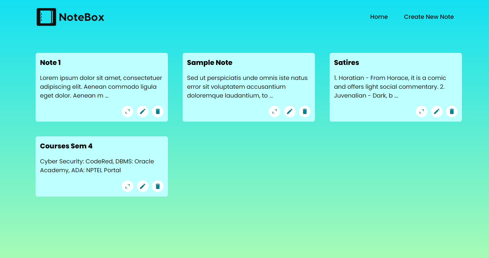

# :notebook: NoteBox
NoteBox is a note making responsive web app which can perform all CRUD (Create Read Update Delete) operations integrated with supabase. All notes are draggable which is implemented with react-beautiful-dnd. Hosted on Vercel.



## :link: Link to the Project
[NoteBox](https://note-box.vercel.app/)

## :computer: Tech Stack
* [React.js](https://reactjs.org/)
* [Supabase](https://supabase.com/)
* [react-beautiful-dnd](https://github.com/atlassian/react-beautiful-dnd)

## Local Setup & Installation
* Clone the repo and install the dependencies.
```
$ npm install
```
* Spin up the development server
```
$ npm run dev
```
